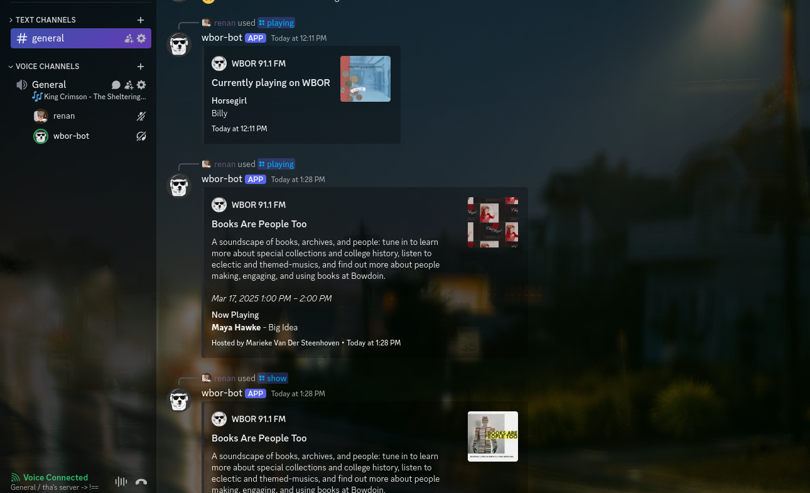

# wbor-discord-bot: AzuraCast-Powered Discord Bot

`wbor-discord-bot` is a simple bot that allows you to interact with [WBOR](https://wbor.org) directly in your guild. You can listen to the station on voice channels, show recent/currently playing songs, and more.

The bot also integrates with Spinitron to information about the show (or automation playlist) currently being broadcast.

This project is a fork of [Azuri](https://github.com/AzuraCast/Azuri). However, we've rewritten it using TypeScript and reorganized the codebase. Little to no original code has been kept.

## Setting up

> [!NOTE]
> Although the bot can be used on other stations without modifications (other than the `.env` file), it was written thinking about WBOR, so some behaviors might be specific to it and might not work as expected.
>
> If something breaks, please consider filing an issue or a pull request. We'll look into it!

- Ensure you have [Docker](https://docs.docker.com/engine/install/) and [Docker Compose](https://docs.docker.com/compose/install/) installed [(if you installed Docker Desktop, it is already installed for you)](https://docs.docker.com/compose/install/#scenario-one-install-docker-desktop).
- Clone this repository and `cd wbor-discord-bot`.
- Run `cp .env.example .env` and fill in the environment variables using your text editor of choice. They're all commented and filled out, so it should be easy.
- Run `docker-compose up -d` to start the bot.

That's pretty much it! Assuming you didn't mess up the environment variables, the bot should be up and running. You will see something like this in your logs:

Type `/` in a server the bot is in and you'll see the available commands.

## TODO

- [x] listen to the station on voice channels;
- [x] show last played tracks, currently playing;
- [x] migrate to typescript;
- [x] update channel status on song changes (only updates when joining the vc);
- [x] update bot presence on song changes;
- [x] dockerize it;
- [x] show current show info when appropiate;
- [ ] stop scraping the spinitron page for show data (use API proxy);
